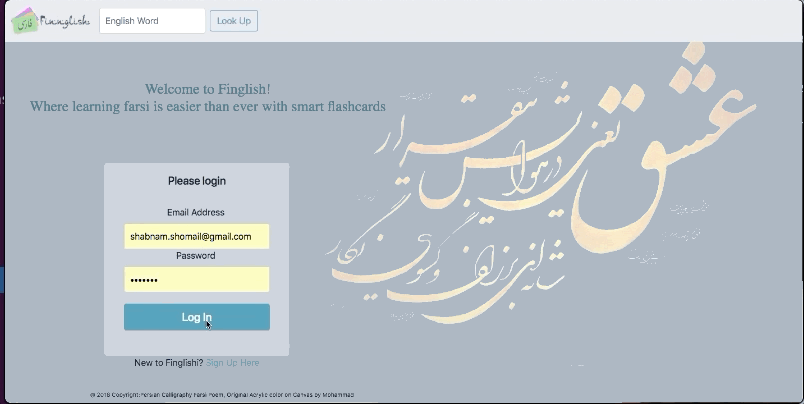
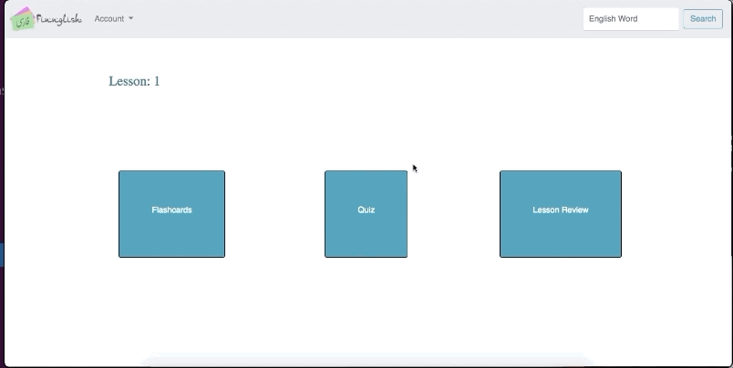

# Finglish 

Finglish is a learning language app that helps users learn new Farsi words using a flashcard system. Inspired by the lack of pronunciation feature in google translate for Farsi language, Finglish brings you pronunciation, translation and phonetic of most common Farsi words using flashcards. Once you are ready, you can take a quiz on each lesson and get an instant result. 

## Table of Contents 
[Tech Stack](#techStack) 
[Requirements](#requirements) 
[Installation](#installation) 
[Features](#features) 
[Future Features](#future_features)

## Tech Stack 
**Backend:** Python, Flask, SQLAlchemy, PostgreSQL, AJAX 
**Frontend:**  Javascript, Jinja, jQuery, Bootstrap, Html, Css 
**Libraries:** Beautiful Soup,  
**APIs:** https://api.forvo.com/  

I built a Postgres database of scraped Farsi words and their translations using beautiful soup library. As an auditory learner, I integrated the pronunciation feature for the Farsi words using an API called forvo.com which crowdsources correct pronunciation. I queried my database using SQL alchemy to create on-demand user lessons that come with a set of flashcards. I used JQuery to demonstrate the flashcards content, and finally, integrated a combination of javascript and CSS to create and animate the flashcards and provide quiz results. 

## Requirements
* Flask==1.0.2
* Flask-DebugToolbar==0.10.1
* Flask-SQLAlchemy==2.3.2
* Jinja2==2.10
* MarkupSafe==1.0
* psycopg2==2.7.5
* SQLAlchemy==1.2.8
* beautifulsoup4
* RequestsSetup

## Installation
1. Pay for forvo.com basic plan and get a Secret KEY and save your Forvo Secret key in secret.sh file  
2. Create a virtual environment: 
        - `$ virtualenv env`
3. Activate virtual environment: 
        - `$ source env/bin/activate`
4. Install requirements: 
        - `$ pip install -r requirements.txt`
5. Create database: 
        - `$ createdb Finglish`               
6. Create your database tables: 
        - `$ python3 model.py`
7. Seed your data:  
        - `$ seed.py`
8. Source secrets.sh: 
        - `$ source secrets.sh`
9. Run the app: 
        -`$ python3 server.py`
10. view your app at : 
        - http://localhost:5000/

        

## Features  
* Register as a new user and log in: 

   

        
* Search for a word in search bar:

   
   
* Look at your lesson overview: 

   
   
* Look at your flashcard:

   

* Take a quiz:
[Quiz](/static/gifs/Quiz.gif)
   

## Future Features   

* Add searched words to lessons 
* Have lessons to reflect the result of the quizes into creation of new lessons 
* Add a notification for words with no pronouciation available 
